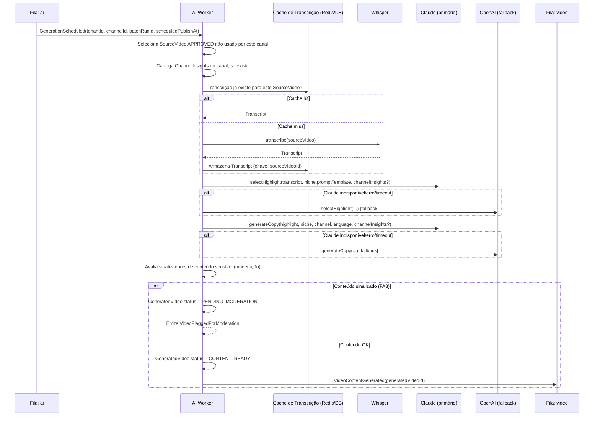

# Fluxo da IA

## Objetivo
Transformar um `SourceVideo` em conteúdo pronto para corte: transcrição, seleção do melhor trecho (15–90s) avaliando melhores momentos/emoção/retenção/potencial viral, e geração de título/descrição/hashtags/CTA — adaptados ao nicho, ao histórico de desempenho do canal (`ChannelInsights`) e variados por canal (ver [ADR-0006](../adr/0006-content-source-strategy.md), [ADR-0014](../adr/0014-learning-loop-prompt-augmentation.md)). Disparado uma vez por vídeo do lote diário (ver [scheduler-flow.md](scheduler-flow.md)).

## Saída da geração de copy

`generateCopy` retorna `VideoCopy { title, description, hashtags, cta }` — o CTA (ex.: "Segue pra não perder o próximo") é gerado como parte da mesma chamada, não uma etapa separada. Extração de thumbnail acontece no Video Worker, não aqui (ver [ADR-0013](../adr/0013-thumbnail-frame-extraction.md)).

## Regra de variação entre canais (anti-duplicidade)

Quando dois canais distintos (do mesmo tenant ou de tenants diferentes) usam o mesmo `SourceVideo`, a **transcrição é compartilhada** (cache), mas a **seleção de trecho e a copy não são** — o prompt de seleção recebe a lista de trechos já usados por outros canais para aquele `SourceVideo` como contexto negativo. Isso é tratado pela `HighlightDiversityPolicy` (ver [domain/policies-specifications.md](../domain/policies-specifications.md)).

## Uso de `ChannelInsights` (loop de aprendizado)

Quando o canal já tem `ChannelInsights` calculado (ver [ADR-0014](../adr/0014-learning-loop-prompt-augmentation.md)), ele é passado como contexto adicional em `selectHighlight`/`generateCopy`: padrões de título com melhor desempenho, hashtags mais associadas a bom engajamento, duração ideal. Canal novo sem histórico simplesmente não recebe esse contexto extra — não é tratado como erro.

## Timeout e custo

- Timeout por etapa: transcrição 5 min, seleção 60s, geração de copy 30s (RNF-35).
- Custo (tokens/minutos) é registrado por chamada, associado ao `generatedVideoId`, agregado para RNF-21/22.
