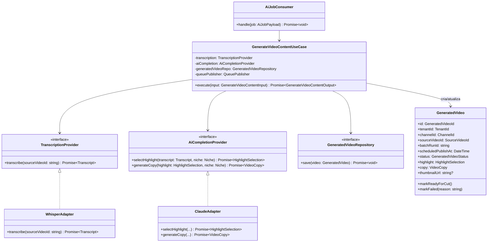

# C4 — Nível 4: Código

## Camadas (Clean Architecture) aplicadas em `apps/api` e em cada worker

```
interface/          → Controllers, Route Handlers, Queue Consumers (entrada)
application/         → Use Cases (Application Services), DTOs de entrada/saída
domain/               → Entities, Value Objects, Aggregates, Domain Services, Events, Policies, Specifications
infrastructure/       → Repositories (Prisma), Adapters (Whisper, Claude, OpenAI, FFmpeg, YouTube, TikTok), Queue (BullMQ)
```

Regra de dependência: **`interface` → `application` → `domain`**, e **`infrastructure` implementa contratos definidos em `domain`/`application`** (nunca o inverso). `domain` não importa nada de `infrastructure` nem de `interface`.

## Exemplo de código — fluxo de classes do caso de uso `GenerateVideoContentUseCase`



## Notas de implementação (para a fase de execução)

- `GenerateVideoContentUseCase` não conhece Whisper, Claude ou Prisma — apenas as interfaces. Isso permite testar 100% da orquestração com dublês de teste (test doubles), sem rede (RNF-30).
- `GeneratedVideo` (Aggregate Root) é o único ponto de mutação de estado válido — `markFailed`/`markReadyForCut` encapsulam transições de estado válidas (ver [domain/entities-value-objects.md](../domain/entities-value-objects.md)).
- Erros de infraestrutura (timeout do Whisper, erro 500 do Claude) são traduzidos em exceções de domínio (`TranscriptionFailedError`, `AiProviderUnavailableError`) antes de subir ao Use Case — a camada de aplicação nunca trata exceção de SDK externo diretamente.
