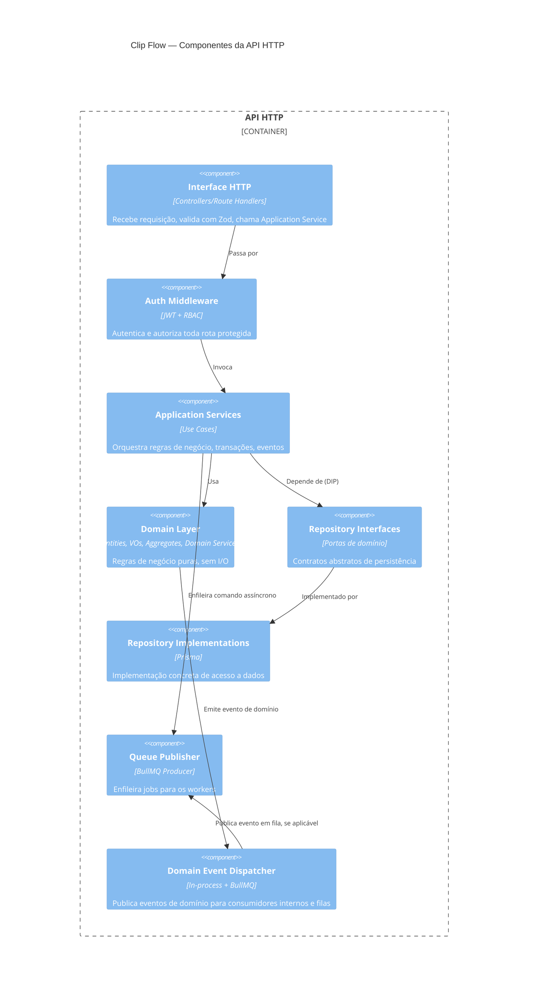
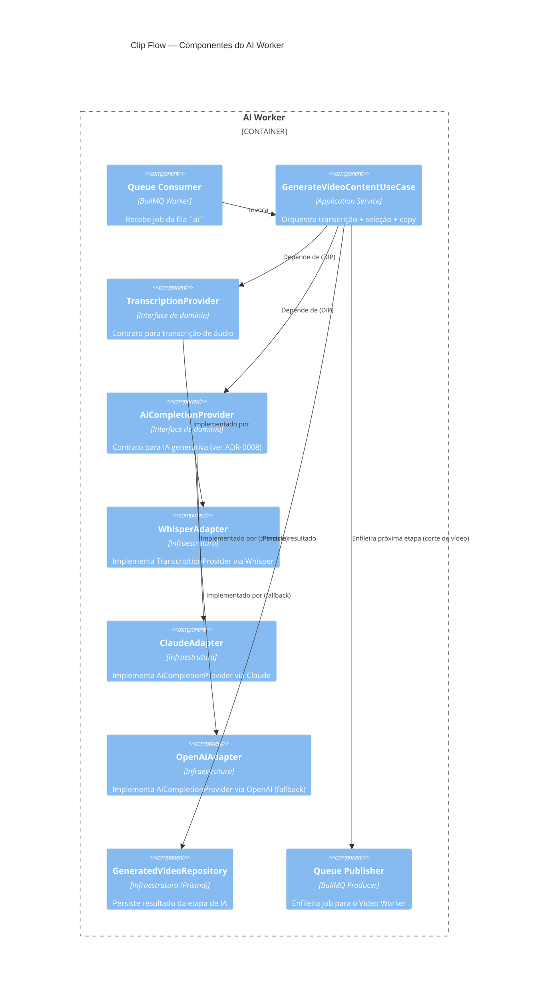

# C4 — Nível 3: Componentes

## 3.1 Componentes da API HTTP

## 3.2 Componentes de um Worker (exemplo: AI Worker)

Todos os workers seguem o mesmo padrão de componentes: `Queue Consumer` → `Use Case` (Application Service) → `Domain`/`Ports` → `Adapters` de infraestrutura → `Queue Publisher` para a próxima etapa do pipeline (ver [event-flow.md](event-flow.md)).
