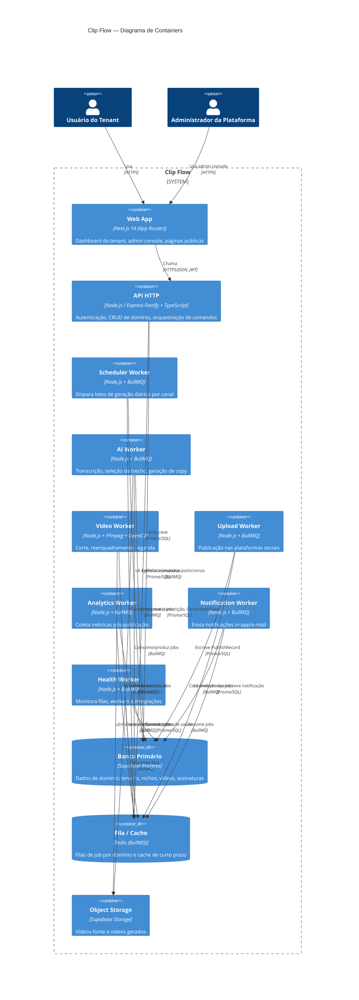

# C4 — Nível 2: Containers

## Containers e responsabilidades

| Container | Responsabilidade | Escala |
|---|---|---|
| Web App | UI do tenant, admin console, páginas públicas | Vercel (edge/serverless) |
| API HTTP | Único ponto de entrada síncrono; nunca executa trabalho pesado | Railway/Render, múltiplas réplicas |
| 7 Workers | Cada um consome exatamente uma fila nomeada; escalam independentemente | Railway/Render, réplicas por fila |
| Banco Primário | Fonte de verdade transacional | Supabase Postgres gerenciado |
| Fila/Cache | Comunicação assíncrona + cache de curto prazo (ex.: transcrição) | Redis gerenciado |
| Object Storage | Armazenamento de vídeo-fonte e vídeo gerado | Supabase Storage |

Nenhum worker expõe porta HTTP pública — todos são processos consumidores de fila, sem superfície de ataque de rede além de saída para integrações externas.
