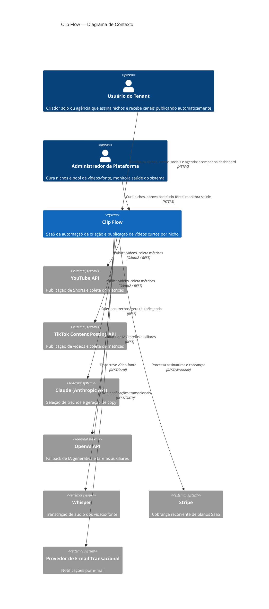

# C4 — Nível 1: Contexto

## Atores e sistemas externos

| Ator/Sistema | Papel |
|---|---|
| Usuário do Tenant | Configura o produto; nunca interage diretamente com o pipeline de geração |
| Administrador da Plataforma | Opera o catálogo de nichos e a saúde operacional; não é tenant |
| YouTube API | Publicação (YouTube Shorts) e leitura de métricas |
| TikTok Content Posting API | Publicação e leitura de métricas |
| Claude / OpenAI | Provedores duais de IA generativa (ver [ADR-0008](../adr/0008-ai-provider-strategy-claude-openai.md)) |
| Whisper | Transcrição de áudio dos vídeos-fonte |
| Stripe | Gateway de pagamento e assinaturas recorrentes |
| Provedor de e-mail | Envio de notificações transacionais (ex.: Resend/SendGrid) |
