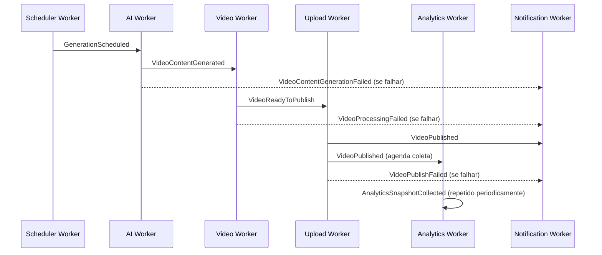

# Fluxo de Eventos de Domínio

Clip Flow usa eventos de domínio para desacoplar etapas do pipeline e para notificar consumidores secundários (notificação, analytics, auditoria) sem acoplar o produtor ao consumidor.

## Catálogo de eventos

| Evento | Publicado por | Consumido por | Payload essencial |
|---|---|---|---|
| `TenantCreated` | API (RF-01) | Notification Worker | `tenantId`, `ownerUserId` |
| `ChannelCreated` | API (RF-04) | Scheduler Worker (registra repeatable job) | `tenantId`, `channelId` |
| `ChannelConfigUpdated` | API (RF-06) | Scheduler Worker (atualiza repeatable job) | `channelId` |
| `ChannelActivated` | API (RF-05, via conexão de conta) | Scheduler Worker | `channelId` |
| `SocialAccountConnected` | API (RF-05) | Notification Worker | `tenantId`, `channelId`, `socialAccountId`, `platform` |
| `SocialAccountNeedsReauth` | Upload Worker / Token Refresh (FA2) | Notification Worker, Scheduler Worker (pausa lote do canal) | `tenantId`, `channelId`, `socialAccountId` |
| `GenerationScheduled` | Scheduler Worker | AI Worker | `tenantId`, `channelId`, `batchRunId`, `scheduledPublishAt` |
| `VideoContentGenerated` | AI Worker | Video Worker | `generatedVideoId` |
| `VideoContentGenerationFailed` | AI Worker | Notification Worker, Health Worker | `generatedVideoId`, `reason` |
| `VideoReadyToPublish` | Video Worker | Upload Worker (delayed até `scheduledPublishAt`) | `generatedVideoId` |
| `VideoProcessingFailed` | Video Worker | Notification Worker, Health Worker | `generatedVideoId`, `reason` |
| `VideoFlaggedForModeration` | AI Worker (FA3) | Notification Worker (admin) | `generatedVideoId`, `flagReason` |
| `VideoPublished` | Upload Worker | Notification Worker, Analytics Worker (agenda primeira coleta) | `generatedVideoId`, `publishRecordId`, `platform` |
| `VideoPublishFailed` | Upload Worker | Notification Worker, Health Worker | `generatedVideoId`, `platform`, `reason` |
| `AnalyticsSnapshotCollected` | Analytics Worker | (persistência apenas) | `publishRecordId`, `metrics` |
| `ChannelInsightsUpdated` | Analytics Worker (RF-17) | AI Worker (lido sob demanda na próxima geração, não reativo) | `channelId`, `computedAt` |
| `PlanLimitReached` | API | Notification Worker | `tenantId`, `limitType` |

## Mecanismo de transporte

- **Dentro do mesmo processo** (ex.: dentro da API, entre Domain Service e Application Service): dispatcher in-process síncrono.
- **Entre processos** (API → Worker, Worker → Worker): o evento de domínio é serializado e publicado como job em uma fila BullMQ nomeada (ver [worker-flow.md](worker-flow.md)). O nome do evento é preservado no payload do job para rastreabilidade em log (`traceId` + `eventName`).
- Eventos que têm múltiplos consumidores (ex.: `VideoPublished`) são publicados em mais de uma fila (fan-out explícito no `Domain Event Dispatcher` — ver [c4-component.md](c4-component.md)), nunca via tópico pub/sub implícito, para manter rastreabilidade clara de quem consome o quê.

## Diagrama — ciclo de vida de eventos do pipeline principal

