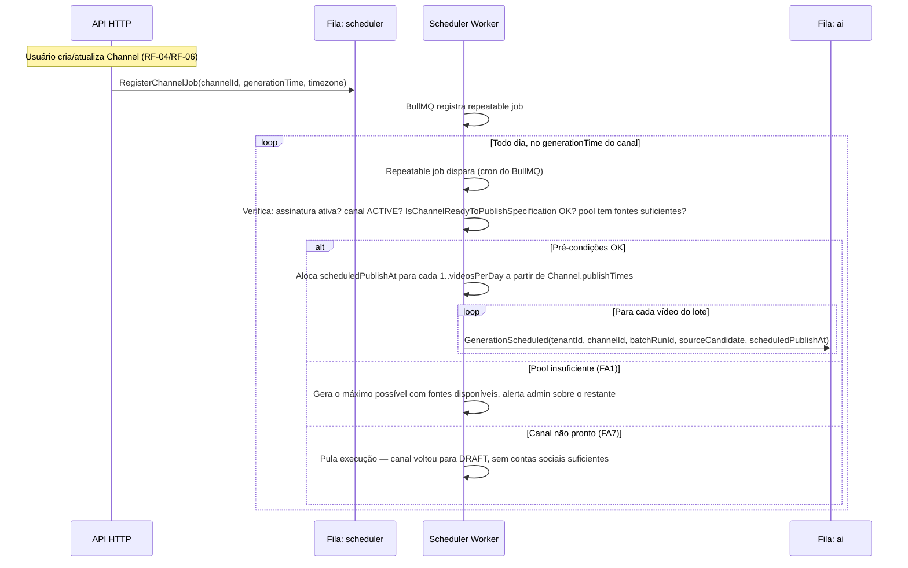

# Fluxo do Scheduler

> Revisado após [ADR-0012](../adr/0012-batch-generation-delayed-publish.md) — geração passou de "1 disparo por slot de publicação" para "1 lote diário por canal, com publicação individual atrasada por vídeo".

## Objetivo
Disparar, todos os dias, **um único job de geração em lote** por `Channel` ativo, no horário de geração configurado (`Channel.generationTime`, padrão 06:00, timezone do tenant), produzindo `videosPerDay` vídeos de uma vez — cada um já nascendo com seu horário-alvo de publicação (`scheduledPublishAt`).

## Mecanismo

O Scheduler Worker **não** faz polling do banco em loop apertado. Ele usa **repeatable jobs do BullMQ**, um por `Channel` ativo, registrado/atualizado sempre que o tenant cria, altera, pausa ou retoma um canal (RF-04/RF-06/RF-14). A API, ao processar essas mutações, publica os comandos `RegisterChannelJob` / `RemoveChannelJob` para o Scheduler Worker manter os repeatable jobs sincronizados com o estado atual do domínio.

## Pré-condições verificadas antes de disparar o lote

1. Assinatura do tenant está `ACTIVE` (não em `PAST_DUE`/`CANCELED`).
2. `Channel.status == ACTIVE` (não `PAUSED`/`DRAFT` — RF-14).
3. `IsChannelReadyToPublishSpecification` satisfeita — contas sociais exigidas por `Channel.platforms` estão `CONNECTED` (FA7).
4. Existem `SourceVideo` `APPROVED` suficientes no nicho do canal, ainda não utilizados por este canal (senão FA1 — gera parcialmente).

## Idempotência

Cada disparo gera um `batchRunId` determinístico (`channelId` + data do dia, no fuso do tenant). Se o worker reiniciar e o repeatable job for reprocessado no mesmo dia, o Scheduler verifica se já existe `GeneratedVideo` para aquele `(channelId, batchRunId, scheduledPublishAt)` antes de enfileirar novamente — evita gerar vídeo duplicado no mesmo lote (RNF-34).

## Publicação — desacoplada da geração

O Scheduler **não** dispara a publicação. Cada vídeo, ao terminar de ser cortado (Video Worker), enfileira seu próprio job de publicação com `delay` calculado até `scheduledPublishAt` (ver [upload-flow.md](upload-flow.md)) — o Scheduler é responsável apenas pelo gatilho matinal do lote.
