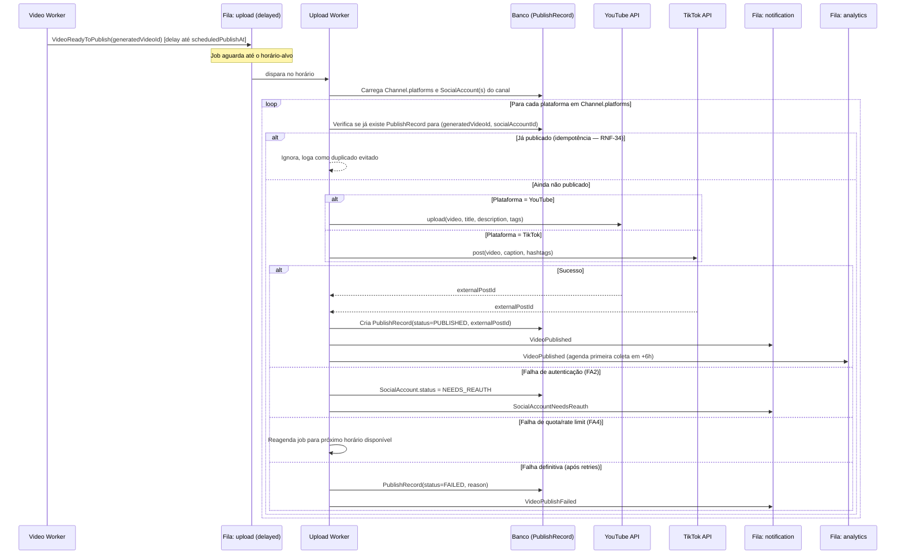

# Fluxo de Upload

## Objetivo
Publicar um `GeneratedVideo` pronto (`status = READY_TO_PUBLISH`) no seu horário-alvo (`scheduledPublishAt`), na(s) `SocialAccount`(s) do canal — espelhando em YouTube Shorts e TikTok simultaneamente quando `Channel.platforms = BOTH` (ver [ADR-0011](../adr/0011-channel-as-aggregate.md), [ADR-0012](../adr/0012-batch-generation-delayed-publish.md)), com idempotência e resiliência a falhas de plataforma.

## Publicação atrasada (delayed job)

O Video Worker, ao concluir o corte, **não publica imediatamente**: enfileira o(s) job(s) de publicação na fila `upload` com `delay = scheduledPublishAt - now` (BullMQ delayed job). Se `scheduledPublishAt` já passou (pipeline atrasou além do previsto), o delay é `0` e a publicação acontece imediatamente.

## Regras específicas

- **Espelhamento ("Ambos")**: quando `Channel.platforms = BOTH`, o mesmo `GeneratedVideo.finalAssetUrl` é usado para publicar em ambas as plataformas — não há reprocessamento por plataforma, apenas o upload do mesmo artefato final duas vezes, gerando 2 `PublishRecord` independentes.
- **Idempotência (RNF-34)**: chave natural `(generatedVideoId, socialAccountId)` é única no banco (`UNIQUE` constraint); tentativa duplicada é sempre no-op seguro, nunca gera segunda publicação.
- **Isolamento por plataforma**: publicar no YouTube e no TikTok para o mesmo `GeneratedVideo` são duas operações independentes dentro do mesmo job (ou dois jobs, na implementação) — falha em uma não afeta a outra (RNF-16).
- **Retry**: máximo 3 tentativas com backoff exponencial (mais conservador que os demais workers — republicar duplicado é pior que atrasar).
- **Rate limit de plataforma (FA4)**: erros HTTP 429/403-quota são tratados como falha transitória, não definitiva — job volta para o fim da fila com delay calculado a partir do header de retry da própria API da plataforma, quando disponível.

Detalhes específicos por plataforma em [integrations/youtube.md](../integrations/youtube.md) e [integrations/tiktok.md](../integrations/tiktok.md).
