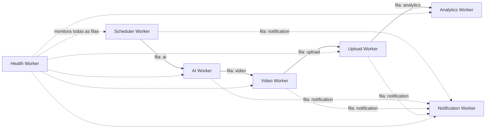

# Fluxo dos Workers

## Visão geral da cadeia

## Relação entre workers

| Worker | Dispara | É disparado por | Isolamento de falha |
|---|---|---|---|
| Scheduler | AI Worker (job `ai`) | Repeatable job (cron interno BullMQ) | Falha em um tenant/nicho não afeta outros — job por `(tenant, niche)` |
| AI | Video Worker (job `video`) | Scheduler Worker | Falha de IA não trava Scheduler; job vai para dead-letter e notifica |
| Video | Upload Worker (job `upload`) | AI Worker | Falha de corte não afeta outros vídeos em processamento |
| Upload | Analytics Worker (job `analytics`, agendado) | Video Worker | Falha em uma plataforma (ex.: TikTok) não bloqueia publicação na outra (YouTube) — jobs por plataforma |
| Analytics | — (terminal, repete via BullMQ repeatable job) | Upload Worker (primeira coleta) + agenda própria | Falha de coleta não afeta o vídeo publicado, apenas atrasa métrica |
| Notification | — (terminal) | Todos os demais workers e a API | Falha de envio não reverte a operação de negócio que a originou |
| Health | — (observador) | Cron interno (a cada 1 min) | Não interfere no fluxo de negócio; apenas lê estado das filas |

## Regras de desenho comuns a todos os workers

- Cada worker consome **exatamente uma fila nomeada** — nunca múltiplas filas no mesmo processo, para manter escalonamento e observabilidade isolados por domínio (ver [ADR-0003](../adr/0003-node-workers-bullmq.md)).
- Todo job carrega `tenantId`, `traceId` e `attempt` no payload, para correlação de log ponta a ponta.
- Toda transição de fila é feita via evento de domínio explícito (ver [event-flow.md](event-flow.md)) — nenhum worker chama outro worker diretamente.
- Retries seguem backoff exponencial (base 5s, máx. 5 tentativas) exceto Upload Worker (máx. 3 tentativas, pois republicar duplicado é mais custoso que falhar).
- Job que esgota tentativas vai para dead-letter queue própria da fila e gera evento `*Failed` consumido pelo Health Worker e Notification Worker.

Detalhe individual de cada worker (entradas, saídas, filas, timeout) em [workers/](../workers/).
