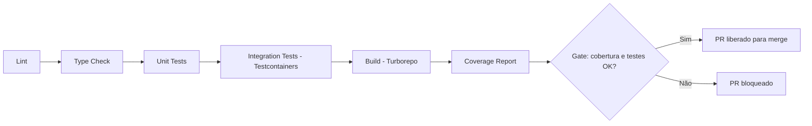
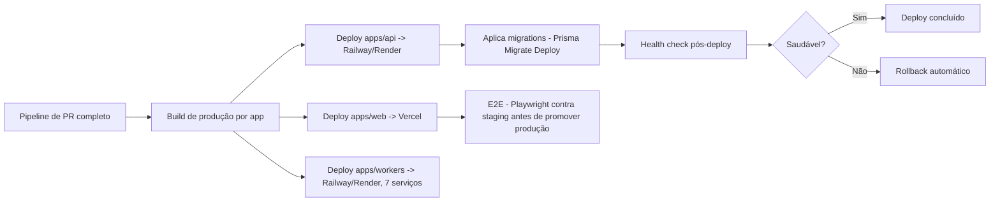

# CI/CD — Pipeline

## Ferramenta
GitHub Actions (`.github/workflows/`), alinhado ao repositório monorepo (ver [ADR-0001](../adr/0001-monorepo-vs-polyrepo.md)).

## Pipeline de PR (`pull_request` para `develop`/`main`)

Turborepo executa apenas os pacotes afetados pelo diff (cache incremental), reduzindo tempo de pipeline em PRs pequenos.

## Pipeline de Deploy (`push` para `main`)

## Etapas detalhadas

1. **Lint**: ESLint + Prettier check, todos os pacotes.
2. **Build**: Turborepo builda `apps/web`, `apps/api`, `apps/workers` (7 imagens Docker para os workers, 1 build Next.js, 1 build API).
3. **Testes**: unit + integração (ver [testing/coverage-pipeline.md](../testing/coverage-pipeline.md)).
4. **Coverage**: publicado como check do PR; bloqueia merge se abaixo da meta.
5. **Deploy**: apenas a partir de `main`, na ordem — migrations antes de subir nova versão da API/workers (migração sempre aditiva/compatível com versão anterior rodando, ver [database/migrations.md](../database/migrations.md), para permitir deploy sem downtime).
6. **Rollback**: se health check pós-deploy falhar, plataforma gerenciada (Vercel/Railway/Render) reverte automaticamente para a última versão saudável (RNF-25, < 5 min).

## Ambientes

| Ambiente | Branch | Propósito |
|---|---|---|
| `development` | local | Desenvolvimento individual, `.env.local` |
| `staging` | `develop` | Homologação, dados de teste, integrações em modo sandbox |
| `production` | `main` | Produção real |

Cada ambiente tem credenciais e projetos de integração completamente isolados (ex.: app OAuth do YouTube de staging ≠ produção) — nunca compartilhados (RNF-26).
