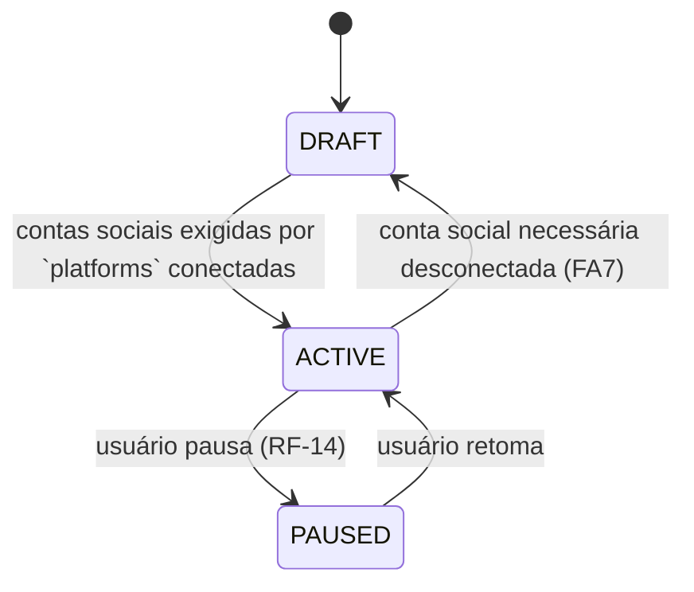
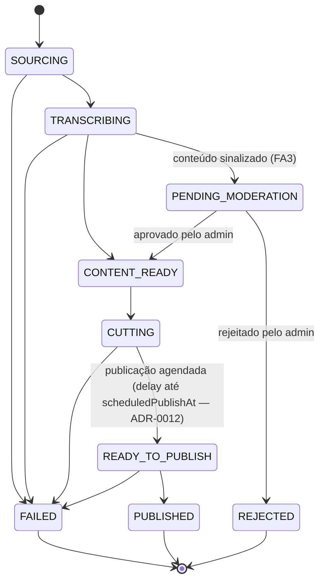

# Entities e Value Objects

Convenção: **Entity** tem identidade e ciclo de vida mutável controlado; **Value Object (VO)** é imutável, comparado por valor, sem identidade própria.

> Revisado após [ADR-0011](../adr/0011-channel-as-aggregate.md) (Channel), [ADR-0012](../adr/0012-batch-generation-delayed-publish.md) (lote/publicação atrasada), [ADR-0013](../adr/0013-thumbnail-frame-extraction.md) (thumbnail) e [ADR-0014](../adr/0014-learning-loop-prompt-augmentation.md) (insights). `NicheSubscription` e `PublishSchedule` foram **removidos** — seus campos migraram para `Channel`.

## Entities por contexto

### Identity & Access
| Entity | Atributos-chave | Invariantes |
|---|---|---|
| `Tenant` | `id`, `name`, `timezone`, `createdAt` | Nome não vazio; timezone IANA válido |
| `User` | `id`, `email`, `passwordHash`, `isPlatformAdmin` | E-mail único globalmente |
| `Membership` | `tenantId`, `userId`, `role` | Um `Tenant` sempre tem ao menos um `Membership` com `role = OWNER` |

### Content Catalog
| Entity | Atributos-chave | Invariantes |
|---|---|---|
| `Niche` | `id`, `name`, `slug`, `status`, `promptTemplateId` | `slug` único; `status` ∈ `{ACTIVE, INACTIVE}` |
| `SourceVideo` | `id`, `nicheId`, `durationSeconds`, `licenseType`, `licenseReference`, `status` | `status` ∈ `{PENDING_REVIEW, APPROVED, REJECTED, ARCHIVED}`; `licenseType`/`licenseReference` obrigatórios para `APPROVED` (ver [ADR-0006](../adr/0006-content-source-strategy.md)) |
| `PromptTemplate` | `id`, `nicheId`, `type`, `content`, `version` | `type` ∈ `{HIGHLIGHT_SELECTION, COPY_GENERATION}` |

### Subscription & Billing
| Entity | Atributos-chave | Invariantes |
|---|---|---|
| `Plan` | `id`, `name`, `maxChannels`, `maxVideosPerDayPerChannel`, `priceCents` | Todos os limites > 0 |
| `Subscription` | `id`, `tenantId`, `planId`, `status`, `currentPeriodEnd` | `status` ∈ `{TRIAL, ACTIVE, PAST_DUE, CANCELED}` |

### Channel Management

| Entity | Atributos-chave | Invariantes |
|---|---|---|
| `Channel` (Aggregate Root) | `id`, `tenantId`, `nicheId`, `name`, `language`, `promptOverride?`, `videosPerDay`, `publishTimes: TimeOfDay[]`, `generationTime: TimeOfDay`, `platforms`, `thumbnailEnabled`, `status` | `nicheId` imutável após criação; `publishTimes.length == videosPerDay`; `videosPerDay` ≤ limite do plano; `platforms` ∈ `{SHORTS_ONLY, TIKTOK_ONLY, BOTH}`; `status` ∈ `{DRAFT, ACTIVE, PAUSED}` — só transiciona para `ACTIVE` quando `IsChannelReadyToPublishSpecification` é satisfeita |
| `SocialAccount` (Aggregate Root próprio) | `id`, `channelId`, `platform`, `externalAccountId`, `status`, `encryptedTokens` | `platform` ∈ `{YOUTUBE, TIKTOK}`; par `(channelId, platform)` único (no máx. 1 conta por plataforma por canal); `status` ∈ `{CONNECTED, NEEDS_REAUTH, DISCONNECTED}` |

### Content Generation
| Entity | Atributos-chave | Invariantes |
|---|---|---|
| `GeneratedVideo` (Aggregate Root) | `id`, `tenantId`, `channelId`, `sourceVideoId`, `batchRunId`, `scheduledPublishAt`, `status`, `highlight`, `copy`, `thumbnailUrl?`, `finalAssetUrl` | Transições de `status` seguem máquina de estados (ver abaixo); par `(batchRunId, scheduledPublishAt)` único por canal (idempotência — RNF-34) |
| `Transcript` | `id`, `sourceVideoId`, `segments`, `language` | `sourceVideoId` único (1 transcrição por vídeo-fonte, cacheada e compartilhada entre canais) |

### Publishing
| Entity | Atributos-chave | Invariantes |
|---|---|---|
| `PublishRecord` | `id`, `generatedVideoId`, `socialAccountId`, `platform`, `externalPostId`, `status` | Par `(generatedVideoId, socialAccountId)` único (RNF-34); `status` ∈ `{PUBLISHED, FAILED}`; quando `Channel.platforms = BOTH`, dois `PublishRecord` nascem do mesmo `GeneratedVideo` |

### Analytics
| Entity | Atributos-chave | Invariantes |
|---|---|---|
| `AnalyticsSnapshot` | `id`, `publishRecordId`, `views`, `likes`, `comments`, `shares`, `retentionRate`, `ctr`, `collectedAt` | Append-only — nunca atualizado após criado |
| `ChannelInsights` (projeção derivada, não Aggregate Root) | `channelId`, `bestPublishHours`, `topTitlePatterns`, `topHashtags`, `avgOptimalDurationMs`, `computedAt` | Sempre reconstruível a partir de `AnalyticsSnapshot`; nunca editado manualmente (ver [ADR-0014](../adr/0014-learning-loop-prompt-augmentation.md)) |

### Notification
| Entity | Atributos-chave | Invariantes |
|---|---|---|
| `Notification` | `id`, `tenantId`, `userId`, `category`, `readAt` | `category` ∈ enum fechado de categorias notificáveis |
| `NotificationPreference` | `userId`, `category`, `emailEnabled` | Par `(userId, category)` único |

## Máquina de estados de `Channel`

## Máquina de estados de `GeneratedVideo`

## Value Objects

| VO | Composição | Regra |
|---|---|---|
| `TenantId`, `NicheId`, `UserId`, `SourceVideoId`, `ChannelId`, `SocialAccountId`, `GeneratedVideoId`, `PublishRecordId` | UUID v4 wrapper | Tipagem nominal — impede passar `ChannelId` onde se espera `TenantId` mesmo ambos sendo string |
| `Email` | string validada | Formato RFC 5322; normalizado para lowercase |
| `TimeOfDay` | `{hour, minute}` | `0 ≤ hour ≤ 23`, `0 ≤ minute ≤ 59`; comparado/ordenado no timezone do `Tenant` |
| `HighlightSelection` | `{startMs, endMs, transcriptSegmentIds}` | `endMs - startMs` entre 15s e 90s (limites de Shorts/TikTok) |
| `VideoCopy` | `{title, description, hashtags, cta}` | `title` ≤ 100 caracteres; `hashtags` ≤ 10 itens; `cta` ≤ 140 caracteres |
| `LicenseInfo` | `{type, reference}` | `type` ∈ `{PUBLIC_DOMAIN, CREATIVE_COMMONS, PARTNER_AGREEMENT}` |
| `Money` | `{amountCents, currency}` | `amountCents` inteiro ≥ 0; `currency` ISO 4217 |
| `EncryptedToken` | `{ciphertext, keyVersion, refreshExpiresAt}` | Nunca exposto em log/serialização de domínio (ver [security/secrets-encryption.md](../security/secrets-encryption.md)) |
