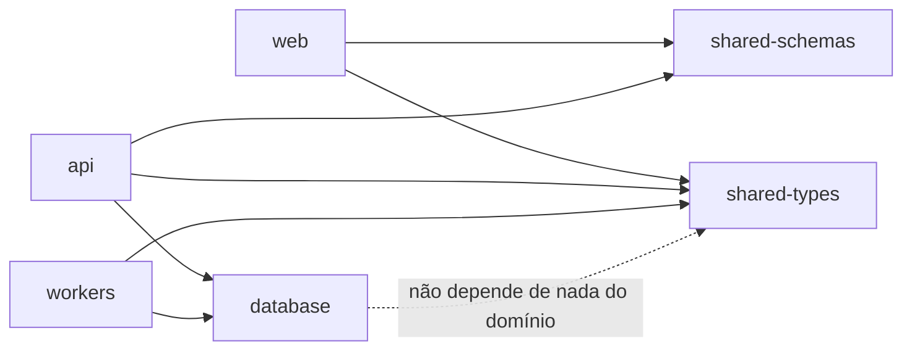

# Estrutura de Pastas

## Monorepo (raiz)

```
clip-flow/
├── apps/
│   ├── web/                  # Next.js — dashboard do tenant, admin console, páginas públicas
│   ├── api/                  # API HTTP — Clean Architecture
│   └── workers/              # 7 workers — cada um um entrypoint, Clean Architecture compartilhada
├── packages/
│   ├── database/              # Schema Prisma + client gerado + migrations (fonte única de verdade de schema)
│   ├── shared-types/           # Value Objects de identidade, tipos compartilhados (Shared Kernel — ver domain/bounded-contexts.md)
│   ├── shared-schemas/         # Schemas Zod compartilhados entre API e frontend (contratos de request/response)
│   └── shared-ui/              # Componentes shadcn/ui compartilhados (se `web` crescer para multi-app)
├── docs/                       # Esta documentação
├── .github/workflows/           # Pipelines de CI/CD
├── turbo.json
├── pnpm-workspace.yaml
└── package.json
```

## `apps/api` (Clean Architecture)

```
apps/api/src/
├── interface/
│   ├── http/
│   │   ├── controllers/        # Um arquivo por recurso (ex.: niches.controller.ts)
│   │   ├── middlewares/        # auth, rbac, rate-limit, error-handler
│   │   └── routes/             # Registro de rotas por domínio
├── application/
│   └── use-cases/
│       └── <bounded-context>/  # Ex.: subscription/, social-integration/, scheduling/
├── domain/
│   └── <bounded-context>/
│       ├── entities/
│       ├── value-objects/
│       ├── services/
│       ├── policies/
│       ├── specifications/
│       ├── events/
│       └── repositories/       # Interfaces (portas)
├── infrastructure/
│   ├── repositories/           # Implementações Prisma
│   ├── queue/                  # Producers BullMQ
│   └── adapters/                # Stripe, e-mail
└── main.ts
```

Responsabilidade por diretório: `interface` traduz protocolo (HTTP) em chamada de `application`; `application` orquestra sem regra de negócio própria complexa; `domain` é a única camada com regra de negócio; `infrastructure` é a única camada que conhece bibliotecas externas concretas. Dependência sempre aponta para dentro (`interface → application → domain`), nunca o inverso.

## `apps/workers` (por worker)

```
apps/workers/src/
├── video/
│   ├── interface/queue-consumers/
│   ├── application/use-cases/
│   ├── domain/                 # Reaproveita bounded context de Content Generation
│   ├── infrastructure/adapters/ffmpeg/, opencv/
│   └── main.ts
├── scheduler/
├── ai/
├── upload/
├── analytics/
├── notification/
└── health/
```

Cada worker é um entrypoint independente (`main.ts` próprio, Dockerfile próprio), mas todos importam `domain` do mesmo bounded context de `packages/database`/`packages/shared-types` — não há duplicação de entidade entre workers que compartilham contexto (ex.: `video` e `ai` compartilham o bounded context Content Generation).

## `apps/web` (feature-based, Next.js App Router)

```
apps/web/src/
├── app/
│   ├── (public)/                # landing, pricing, login, register
│   ├── (dashboard)/              # área autenticada do tenant
│   └── (admin)/                  # console administrativo
├── features/
│   ├── niches/
│   ├── social-accounts/
│   ├── schedules/
│   ├── videos/
│   ├── analytics/
│   └── billing/
├── components/
│   ├── ui/                       # shadcn/ui (gerado)
│   └── shared/
├── lib/
│   ├── api-client.ts
│   ├── query-client.ts
│   └── utils.ts
└── stores/                        # Zustand — estado global (ex.: preferências de UI)
```

Cada pasta em `features/` segue a convenção de contrato público (`index.ts`) já documentada na stack padrão do projeto (Next.js/TypeScript/Zod/TanStack Query/shadcn/Zustand) — ver [conventions.md](conventions.md).

## Dependências entre pacotes (regra de comunicação)



`packages/database` nunca importa `apps/api` ou `apps/workers` — é a camada mais interna, sem conhecimento de quem a consome.
